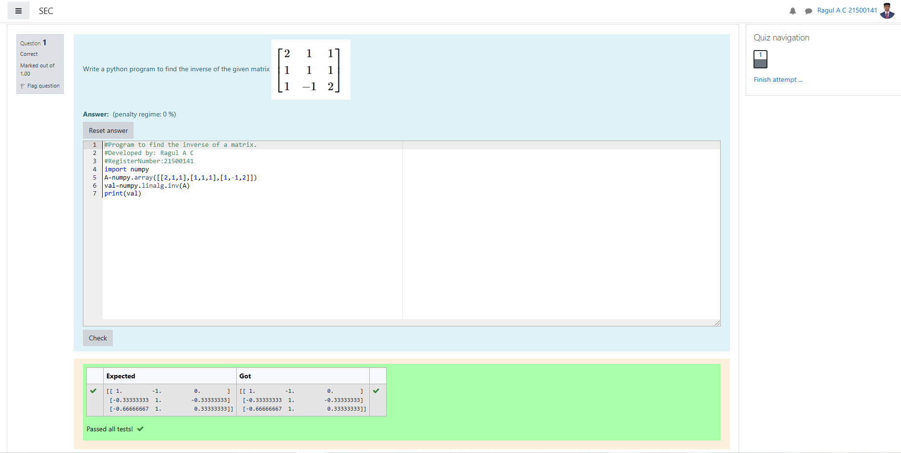

# INVERSE-OF-A-MATRIX
## Aim:
To write a python program to find the inverse of a matrix
## Equipment’s required:
1. 	Hardware – PCs
2. 	Anaconda – Python 3.7 Installation / Moodle-Code Runner
## Algorithm:
### Step1 : 
import the numpy module to use the built-in functions for calculation 
### Step 2: 
prepare the list from each inverse of the matrix and assing in np.array()
### Step 3: 
using the np.linalg.solve(),we can find the solutions.
### Step 4:
end the program
## Program:
```
#Program to find the inverse of a matrix.
#Developed by: Ragul A C
#RegisterNumber:21500141
import numpy
A=numpy.array([[2,1,1],[1,1,1],[1,-1,2]])
val=numpy.linalg.inv(A)
print(val)
```
## Output:

## Result:
Thus the inverse of a matrix is successfully solved using python program

